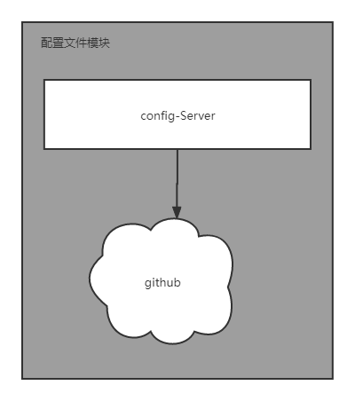
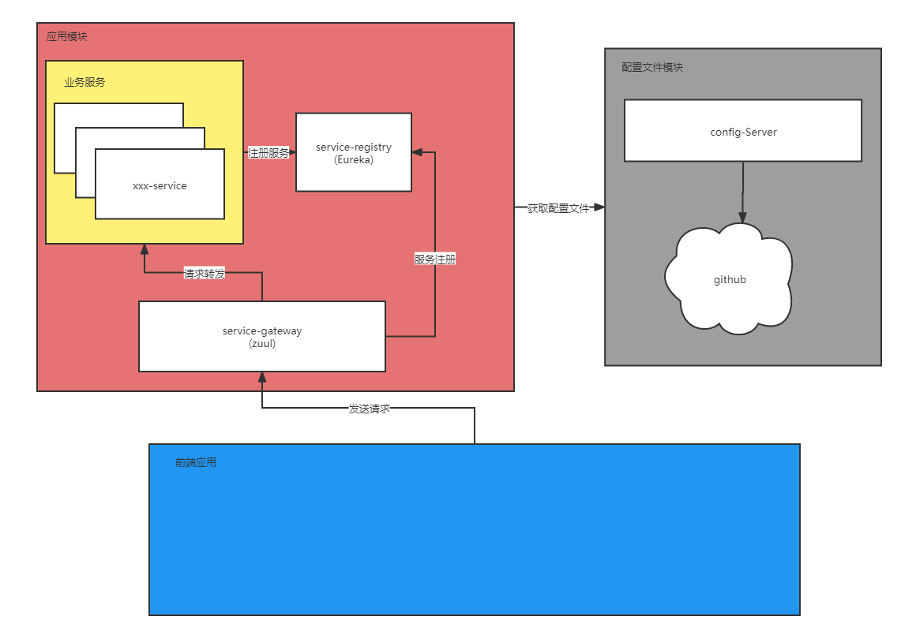

## 模块
  现在项目模块分为两部分。

  一是配置管理模块，配置存放在项目`springcloud-basse-config`中。

  另一块是应用模块，应用模块也分为两块 基础应用（`springcloud-infrastructure`）和业务应用(`springcloud-base`)。
  基础应用包括基本工具模块，异常模块等可以分离重复使用的，另外封装为基础应用。
  业务应用包括针对各自应用系统对不用的业务开发需求进行开发的功能模块。
## 框架结构图
  ### 配置管理模块
  
  ### 完整系统图
  